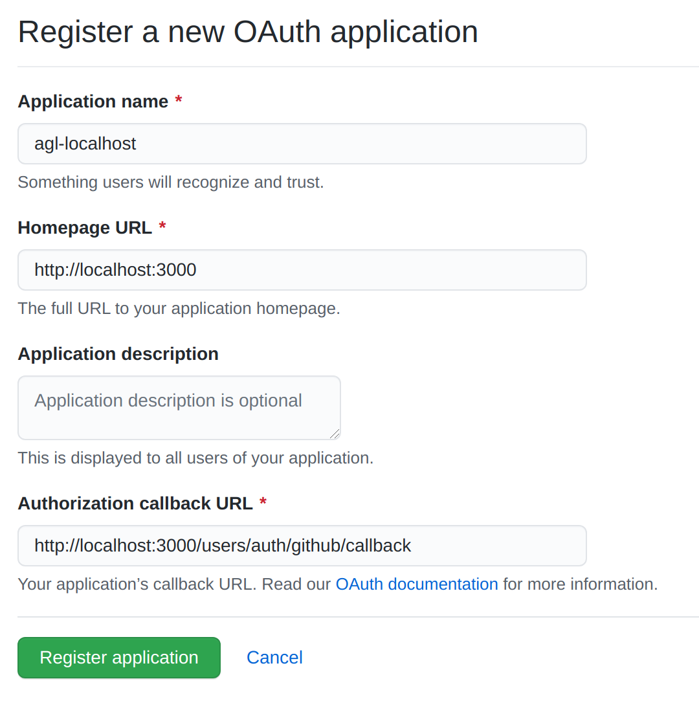

# Development Environment Setup

Welcome to the project! This guide will cover setting up your local development environment using Docker. While it's possible to set up a native Rails development environment, using Docker ensures we avoid any compatibility issues between different developers and our deployed instance.

Let's jump into it:

1. Install Docker and docker-compose on your computer if you do not have them already. You can find installation instructions for docker-compose [here](https://docs.docker.com/compose/install/). Note that on Mac and Windows, docker-compose comes with the Docker Desktop distribution, but on Linux systems, the Docker Engine has to be [installed separately](https://docs.docker.com/engine/install/#server).
2. Clone the `anacapa-github-linker` repository into your preferred local directory:
    ```shell
   git clone https://github.com/brownfield-team/anacapa-github-linker.git
    ```
3. cd into the cloned repository.

Now we need to set up our .env file with various secrets to allow our local environment to integrate with GitHub and other services.
1. First, create your .env file by copying the template .env file:
    ```shell
   cp dotenv.example .env
    ```
   Note that the above command will work only on *nix systems, not Windows. For Windows, you can copy the file using File Explorer manually or use the `copy` command.
2. Now, we need to create our GitHub OAuth credentials. Navigate to [https://github.com/settings/developers](https://github.com/settings/developers). Click "New OAuth App". Fill out the form as such:

   Click "Register application". On the page you're redirected to, click "Generate a new client secret". Now, copy the Client ID and Client Secret into the `OMNIAUTH_PROVIDER_KEY` and `OMNIAUTH_PROVIDER_SECRET` fields of your .env file.
   
3. Next, we need to create our GitHub machine user. Go to [https://github.com/settings/tokens](https://github.com/settings/tokens). Click "Generate new token". Call your token "anacapa-machine-user" and give it the `repo`, `workflow`, `admin:org`, `admin:repo_hook`, and `admin:org_hook` scopes. Copy the generated token into the `MACHINE_USER_KEY` field of your .env file. Also add your GitHub username in the `MACHINE_USER_NAME` fie  ld.

4. Finally, using your preferred source of entropy (mashing your keyboard, for example), create random **alphanumeric** strings in your `GITHUB_WEBHOOK_SECRET` and `DEVISE_SECRET_KEY` fields. These should be approximately the length of your `OMNIAUTH_PROVIDER_SECRET`, but it doesn't really matter as long as there is some value there.

5. For now, we'll leave the Slack info blank. If you're working with Slack, you can follow the linked instructions in the .env file to get setup with those credentials.

Next, we're going to build our Docker container and spin up our app.
1. To set up your app's Docker environment (you typically only need to do this the first time, or when adding a yarn package/Gem), run:
    ```shell
   docker-compose build web
    ```
   This will probably take a few minutes. Consider taking a short walk.
2. Once that's done, we need to set up our database. Run:
    ```shell
   docker-compose run web rails db:create
   docker-compose run web rails db:migrate
    ```

And that's it! To run the app now (and in the future), run:
```shell
docker-compose up web
```